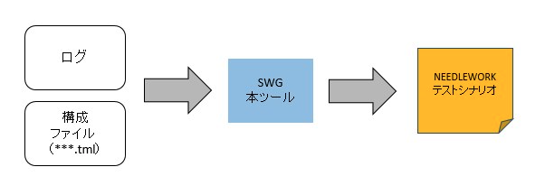
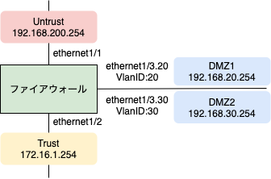

# NEEDLEWORK-ScenarioWriter-Gluttony
# はじめにお読みください

本ツールはMITライセンスです。
ライセンスの内容および注意事項・仕様を確認のうえ、同意いただける場合にのみご利用ください。

本ツールは補助ツールとして公開しています。
サポートはベストエフォートとなり、動作を保証するものではないことをあらかじめご了承願います。

また、本ツールにプログラミング上の誤りその他の瑕疵のないこと、
本ツールが特定目的に適合すること並びに本ツール及びその利用が利用者または第三者の権利を侵害するものでないこと、その他いかなる内容の保証も行うものではありません。本ツールに関して発生するいかなる問題も、利用者の責任及び費用負担により解決されるものとします。

# 本ツールについて

ネットワーク機器のログファイルからNEEDLEWORKのシナリオファイルを生成するツールです。<br>

※ネットワークテスト自動化プロダクト「NEEDLEWORK（ニードルワーク）」<br>
[https://www.ap-com.co.jp/ja/needlework/](https://www.ap-com.co.jp/ja/needlework/)


## ツールイメージ
 <br>
ログファイルと構成ファイル（※）を読み込ませ、NEEDLEWORKのテストシナリオを生成します。 <br>
※ネットワーク機器のゾーン名、IPアドレス等を定義したファイルです

## 対応しているログ
現在対応しているネットワーク機器・ログは以下の通りです。

- Palo Alto Networks 次世代ファイアウォール
    - Trafficログ ※機器からのエクスポートログ、SYSLOGに対応

    ※検証はPAN-OS 8.1で行っています

- Fortinet FortiGate
    - Trafficログ ※機器からのエクスポートログ、SYSLOGに対応

    ※検証はFortiOS 5.2.3で行っています

ログのフォーマットはデフォルトのみに対応しています。<br>

# ツールの利用方法

本ツールはの利用方法は以下の通りです。

## 動作環境

OS : Windows 10

## 事前準備

1．[こちらから](http://s.naitwo.me/swg)、zipファイルをダウンロードします。<br>
　※最新バージョンをご利用ください<br>
　※`swg_v*.*.zip` という名称です<br>


2．zipファイルを任意のディレクトリに解凍します。<br>

　以下のファイルが含まれています。<br>
  - swg.exe                     ：ツール本体<br>
  - readme.txt                  ：はじめにお読みください<br>
  - LICENSE                     ：ライセンス<br>
  - sample/config.tml           ：サンプル構成ファイル<br>
  - sample/sample_**_traffic.log：サンプルログ

3．構成ファイル（config.tml）を編集します。

　構成ファイルはtomlというフォーマットで定義します。<br>

　以下の内容で設定します。<br><br>
  記載した値を参照してログからシナリオを生成しているので正確に記載をお願いします。<br>
  ※devicenameは大文字小文字を区別しません<br>
  ※その他の項目は大文字小文字を区別するため正確に記載をお願いします<br>

```
[device]
devicename = "PaloAlto、またはFortiGateと記載"

[[device.interface]]
ifname  = "インターフェース名を記載"
ip      = "インターフェースに設定しているIPアドレスを記載"
zone    = "インターフェースに設定しているZONE名を記載"
　　　　　　※FortiGateの場合は不要
vlanid  = "インターフェースに設定しているVLAN IDを記載" 
　　　　　　※VLAN Tagが設定されていない場合は空白、「0」を記載

※インターフェースの数だけ"[[device.interface]]"セクションをコピーして記載します。

```

### 構成ファイルの記載方法（サンプル）

### 構成 

 

### 構成ファイル
```

[device]
devicename = "PaloAlto"

[[device.interface]]
ifname  = "ethernet1/1"
ip      = "192.168.200.254"
zone    = "Untrust"
vlanid  = "" 

[[device.interface]]
ifname  = "ethernet1/2"
ip      = "172.16.1.254"
zone    = "Trust"
vlanid  = ""

[[device.interface]]
ifname  = "ethernet1/3.20"
ip      = "192.168.20.254"
zone    = "DMZ1"
vlanid  = "20" 

[[device.interface]]
ifname  = "ethernet1/3.30"
ip      = "192.168.30.254"
zone    = "DMZ2"
vlanid  = "30" 

```

## 実行手順

1．コマンドプロンプトを起動し、事前準備でダウンロードしたツールの格納ディレクトリに移動します。

2．下記コマンドをコマンドプロンプトで実行します。

```
swg -f <ログファイルパス> [オプション]

# オプション
-c              ：構成ファイルパスを指定（デフォルト：config.tml）

# コマンド例
swg -f sample_traffic.log -c config02.tml
```

3．下記ファイルがツールと同じディレクトリに出力されます。
  - NEEDLEWORK_Scenario_xxxxxxxxxxxx.csv <br>
   → シナリオファイルです。
  - result_xxxxxxxxxxxx.txt <br>
   → 実行結果です（問題なく完了していれば中身は空）。シナリオ出力をスキップしたログ情報等が出力されます。

# 今後追加予定の機能

- 重複ログの除外
- 他ベンダー機器の対応
ご要望ありましたら[Twitter](https://twitter.com/naitwo2)のDM等でご連絡ください

# お問い合わせ

- 改善・要望等ございましたらissueに記載してください。

※記載されている会社名及び商品名、サービス名は各社の商標または登録商標です
